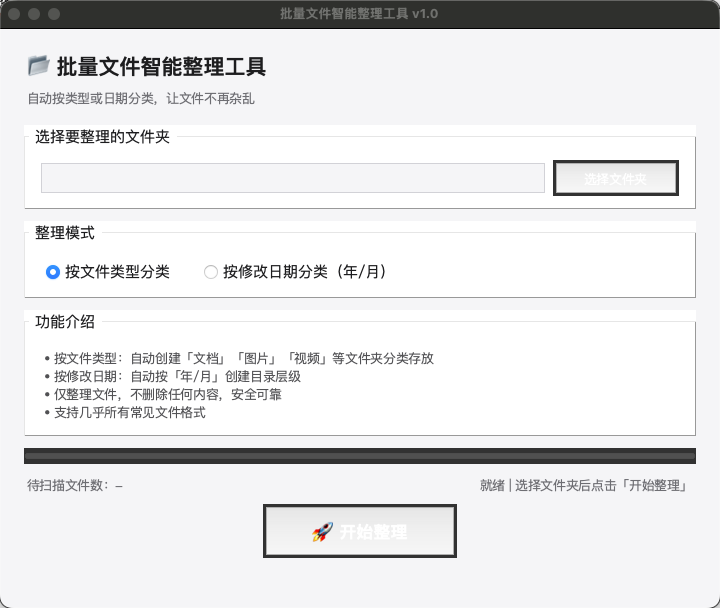

# File Organizer Tool

> One-click file organization & smart categorization

[中文版本](README.md)

---

## 📝 Introduction

File Organizer Tool is a cross-platform desktop application that automatically scans folders and intelligently sorts files into categorized subfolders by type. Supports macOS and Windows.

## ✨ Features

- **Smart Categorization**: Auto-detects 10+ file types — documents, images, videos, audio, archives, code, and more
- **Cross-Platform**: Works on macOS (native .app) and Windows
- **GUI**: Clean and intuitive Tkinter interface
- **Fast & Efficient**: Batch-process large numbers of files in milliseconds
- **Open Source**: Fully transparent, MIT licensed

## 📸 Screenshots

## 📦 Download

### macOS
- [Download for macOS](文件智能整理工具_v1.0_macOS.zip) — 27MB, extract & run

### Windows
- [Download for Windows](文件智能整理工具_Windows版.zip) — includes one-click launcher

## 🔧 Usage

### macOS
1. Download and extract `文件智能整理工具_v1.0_macOS.zip`
2. Drag `文件智能整理工具.app` into the `Applications` folder
3. If you see "unidentified developer" warning, go to **System Settings → Privacy & Security → Open Anyway**
4. Launch the app, select a folder, and click "开始整理" (Start)

### Windows
1. Download and extract `文件智能整理工具_Windows版.zip`
2. Double-click `一键运行.bat`
3. Or run `python file_organizer.py` in terminal

## 🧩 File Categories

| Category | File Extensions |
|----------|-----------------|
| Documents | .doc, .docx, .pdf, .txt, .md, .xls, .xlsx, .ppt, .pptx |
| Images | .jpg, .jpeg, .png, .gif, .bmp, .webp, .svg, .ico |
| Videos | .mp4, .avi, .mkv, .mov, .wmv, .flv |
| Audio | .mp3, .wav, .flac, .aac, .ogg |
| Archives | .zip, .rar, .7z, .tar, .gz |
| Code | .py, .js, .html, .css, .java, .cpp, .c, .go, .rs |
| Other | Unmatched file types |

## 🛠️ Tech Stack

- **Language**: Python 3
- **GUI**: Tkinter
- **Packaging**: PyInstaller
- **Support**: macOS ARM64 / Windows x64

## 📄 License

This project is open-sourced under the MIT License.

---

## ❤️ Support the Author

If you find this tool useful, feel free to scan the QR code to support the author (suggested ¥9.90 / ~$1.40) ❤️

Thank you for your support! 🙏
